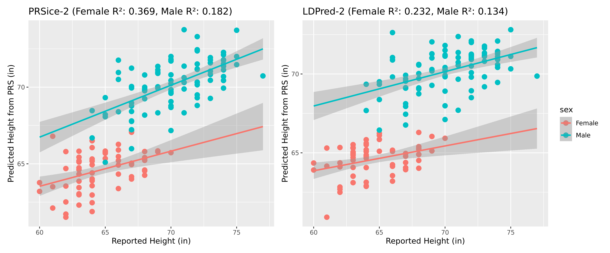
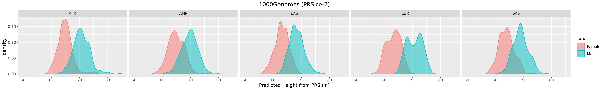
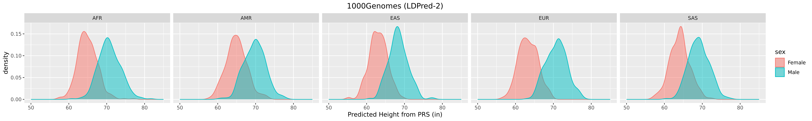

# Comparative Analysis of PRSice2 and LDPred to Compute Polygenic Risk Scores for Human Height   
**Authors:** Kate Jackson (A16781414) and Fatemeh Heydari (A69027046)

## Respository Structure
- **results_graphing.R:** RScript used to produce all output plots 
- **PGP_results.png:** Plot of reported vs. predicted heights for Harvard PGP data with LDPred-2 and PRSice-2
- **1000G_LDPred2_results.png:** Histogram of predicted heights for 1000 Genomes data with LDPred-2
- **1000G_PRSice2_results.png:** Histogram of predicted heights for 1000 Genomes data with PRSice-2
- **LDPred2:** Data and scripts to run LDPred-2
  - **1000Genomes:** Selected (<100MB) 1000 Genomes data
    - **1000G_phenotypes.tsv:** Height summary data by subpopulation from Yengo et al. (2022)
    - **igsr_samples.tsv** Supopulation data from 1000 Genomes
  - **HarvardPGP:** Selected (<100MB) Harvard PGP data
    - **PGP_data_processing.sh:** Bash script with commands used to preprocess PGP data
    - **PGP_phenotypes.csv:** Height data from Harvard PGP survey
  - **LDPred2_running.R**: RScript used to run LDPred-2
  - **ldpred2_1000G_results.tsv:** PRS for 1000 Genomes data with LDPred-2
  - **ldpred2_PGP_results.tsv:** PRS for Harvard PGP data with LDPred-2
- **PRSice2:** Data and scripts to run PRSice-2
  - **PRSice_PGP_data...:** Selected (<100MB) PGP data
  - **1000Genomes:** Selected (<100MB) 1000 Genomes data and outputs
    - **PRSice_1000G.score:** PRS for 1000 Genomes with PRSice-2
  - **HarvardPGP:** Selected (<100MB) 1000 Genomes data and outputs
    - **PRSice_PGP.best:** PRS for Harvard PGP with PRSice-2
  
## Introduction

A polygenic risk score (PRS) is a numerical metric to estimate an individual's genetic predisposition for a complex trait or disease. PRSs are computed by summing the effects of thousands of small genetic variants (SNPs) across the entire genome, to quantify a personalized risk score that is independent of environmental risk. Various methods have been developed to calculate PRS. In this project, we compare PRSice-2 and LDpred2, which utilize fundamentally different algorithmic approaches, to predict height, a classic polygenic trait.

PRSice-2 (Choi & O’Reilly, 2019) is the gold standard for the Clumping and Thresholding (C+T) method. It simplifies the genetic architecture by removing correlated SNPs (clumping) and including only those that meet a specific p-value threshold. This method is computationally efficient and interpretable, making it ideal for a preliminary analysis. In contrast, LDpred2 (Privé et al., 2020) utilizes a Bayesian approach to model the LD structure across the entire genome. Rather than discarding SNPs, it re-weights them based on a prior distribution of effect sizes and an LD reference panel. This typically results in higher predictive accuracy, especially for highly polygenic traits where many small-effect variants are masked by strict p-value thresholds in C+T. In this project we will assess and compare the performance of these two methods.

## Methods

### Data Sources
As PRS methods require GWAS summary statistics, we obtained these from Yengo et al. (2022), a comprehensive study conducted across diverse populations to characterize genetic variants associated with human height. From this dataset, we identified relevant SNPs and extracted critical summary statistics, such as effect sizes and p-values. To obtain individual-level genotype and phenotype (height) data, we utilized the Harvard Personal Genome Project (PGP), a public repository where participants share their genomic data for scientific research. From this database, we extracted 23andMe data for 155 individuals. To obtain individual-level genotypes from more diverse populations we used VCF data from the 1000 Genomes Project, however this does not include corresponding phenotype (height) data.

### Data Preprocessing
To prepare the 23andMe data as input for PRS methods, we used PLINK to generate binary files (BED/BIM/FAM) for each individual. During the initial merging process, PLINK generated a .missnp file, identifying variants with allelic inconsistencies (such as multiallelic sites) that prevented a successful merge. We resolved this by excluding these problematic SNPs and re-running the merge to create a unified dataset. 

For all datasets, we used the bigsnpr package to impute missing genotypes. For LDPred-2 we use a LD reference with pre-computed correlations for HapMap3 variants based on UKBiobank data. Therefore, to make the data compatible, we subseted the variants to only those included in HapMap3. Height data was standardized to inches and because sex is a major determinant of height, it was included as a covariate. 

### Computing PRS
We run PRSice-2 with the pre-processed genotype and phenotype data using height as a target and sex as a covariate. To run LDPred-2, we load the all preprocessed data and perform LD score regression using the reference LD matrix and GWAS summary statistics to estimate the weight of each SNP. Then all re-weighted SNPs are used to compute the PRS with LDPred-2 (infinitesmal model). For both results, we fitted a linear regression model using both the PRS and sex as predictors to evaluate the model's accuracy against ground truth height data.

## Results

## Next Steps

We will conduct this analysis using the 1000 Genomes dataset. Although height data is unavailable for this cohort, we will see what insights can be gained. The preliminary results are shown below:

## Sources (Rough Draft)
- [The Harvard Personal Genome Project](https://pgp.med.harvard.edu/data)
- [A global reference for human genetic variation](https://www.nature.com/articles/nature15393)
- [A saturated map of common genetic variants associated with human height](https://www.nature.com/articles/s41586-022-05275-y)
- [International HapMap Project](https://www.broadinstitute.org/medical-and-population-genetics/hapmap-3)
- [LD reference for HapMap3](https://figshare.com/articles/dataset/LD_reference_for_HapMap3_/21305061)
- [PRSice-2 Tutorial](https://choishingwan.github.io/PRS-Tutorial/prsice/)
- [LDPred-2 Tutorial](https://choishingwan.github.io/PRS-Tutorial/ldpred/)
- CSE 284 Lecture on PRS
